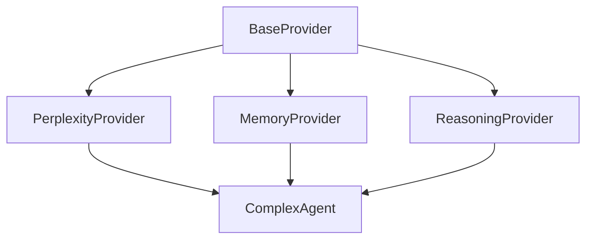

# SentientOne Project Status

## Project Overview
SentientOne is an advanced AI framework designed to create and manage intelligent agents with sophisticated cognitive capabilities. The project aims to provide a modular, extensible architecture for building AI systems that can understand, learn, and interact in complex environments.

### Core Objectives
1. Provider Architecture
   - Create a flexible provider system for different AI capabilities
   - Enable easy extension and customization of provider behaviors
   - Support both synchronous and asynchronous operations
   - Maintain clean separation between interface and implementation

2. Agent Intelligence
   - Build sophisticated agents that can understand and process complex tasks
   - Implement memory and reasoning capabilities
   - Enable natural language understanding and generation
   - Support multi-step planning and execution

3. System Reliability
   - Ensure robust error handling and recovery
   - Implement comprehensive testing and validation
   - Maintain system stability under various conditions
   - Support debugging and monitoring capabilities

### Current Project Phase
- **Phase**: Alpha Development
- **Focus**: Core Infrastructure and Testing
- **Stage**: Provider Implementation and Validation

## Project Context

### Recent Major Changes
1. Framework Restructuring (2024-12-20)
   - Moved from flat structure to base/core architecture
   - Relocated all providers from root `providers/` to `framework/base/providers/` and `framework/core/providers/`
   - Created new examples directory with provider demonstrations
   - Consolidated multiple .todo files into organized docs/todo structure

2. Test Suite Implementation (2024-12-20)
   - Implemented comprehensive provider test suite
   - Added proper async test infrastructure
   - Completed base provider validation tests
   - Added provider mode and state management tests
   - Implemented Perplexity provider test coverage
   - Added example test implementations

### Current Directory Structure
```
SentientOne/
├── framework/
│   ├── base/
│   │   └── providers/         # Base provider implementations
│   │       ├── agents/       # Base agent provider
│   │       ├── memory/       # Base memory provider
│   │       ├── reasoning/    # Base reasoning provider
│   │       └── baseprovider.py  # Core provider class
│   └── core/
│       ├── agents/           # Agent implementations
│       │   └── complex_agent.py  # Current focus
│       └── providers/        # Specific provider implementations
│           └── perplexity_provider.py  # Active development
├── examples/
│   └── providers/           # Provider usage examples
│       └── perplexity_examples.py  # Implementation examples
├── tests/                   # New test structure
│   ├── base/
│   ├── core/
│   └── integration/
└── docs/
    └── todo/               # Organized TODO files
```

### Active Development State
1. Last Working Point:
   - Successfully restructured framework
   - Created new test infrastructure
   - Base provider functionality verified
   - Perplexity provider fully tested
   - Comprehensive test suite implemented for all current providers
   - Example implementations with test coverage

2. Current Task:
   - Expanding integration test coverage
   - Addressing test infrastructure warnings
   - Updating provider documentation
   - Implementing additional provider tests

3. Known Issues:
   - Import paths may need verification
   - Provider redirects potentially broken
   - pytest-asyncio event loop warning
   - Documentation needs updating

## Project Challenges and Solutions

#### Current Challenges
1. Architecture Complexity
   - **Issue**: Managing complex provider interactions and dependencies
   - **Solution**: Implemented clear base/core separation and provider chain architecture
   - **Status**: Partially resolved, needs further refinement

2. Async Implementation
   - **Issue**: Handling async operations consistently across providers
   - **Solution**: Adopted async-first approach with proper error handling
   - **Status**: Basic implementation complete, needs optimization

3. Testing Infrastructure
   - **Issue**: Complex async testing scenarios and mocking
   - **Solution**: Implemented comprehensive test suite with async support
   - **Status**: Core functionality tested, expanding coverage

4. Documentation Gaps
   - **Issue**: Incomplete documentation for new features and changes
   - **Solution**: Creating structured documentation with examples
   - **Status**: In progress

#### Resolved Issues
1. Provider Structure
   - **Previous**: Flat provider hierarchy causing maintenance issues
   - **Solution**: Implemented base/core split architecture
   - **Impact**: Improved code organization and maintainability

2. Test Coverage
   - **Previous**: Limited test coverage for provider functionality
   - **Solution**: Implemented comprehensive test suite
   - **Impact**: Better reliability and easier debugging

## Development Principles
1. Code Quality
   - Strict typing enforcement
   - Comprehensive error handling
   - Clear documentation requirements
   - Test coverage requirements

2. Architecture Guidelines
   - Clear separation of concerns
   - Provider independence
   - Explicit dependencies
   - Consistent async patterns

3. Testing Standards
   - Unit tests for all providers
   - Integration tests for provider chains
   - Performance benchmarks
   - Error scenario coverage

## Future Considerations
1. Short-term Goals (Next 2 Weeks)
   - Complete provider test coverage
   - Resolve async implementation issues
   - Update all documentation
   - Implement monitoring system

2. Medium-term Goals (Next 2 Months)
   - Implement advanced agent capabilities
   - Add provider chain optimization
   - Enhance error recovery
   - Improve performance monitoring

3. Long-term Vision
   - Full cognitive architecture implementation
   - Advanced reasoning capabilities
   - Learning and adaptation features
   - Robust production deployment

## Testing Infrastructure

### Test Suite Status
1. Completed Components:
   - Base test structure created
   - Test utilities implemented
   - Basic fixtures defined
   - Initial provider tests written
   - Base provider tests completed
   - Provider mode validation implemented
   - Async operation testing established
   - Perplexity provider tests implemented
   - Example code test coverage added

2. In Progress:
   - Integration test cases
   - Event loop configuration optimization
   - Test coverage documentation
   - Additional provider test implementations

3. Test Dependencies:
   - pytest
   - pytest-asyncio
   - unittest.mock
   - asyncio
   - aiohttp (for API tests)

### Critical Test Cases
1. Base Provider:
```python
# Implemented test scenarios
def test_base_provider_creation():
    """Validates provider instantiation and mode setting"""

def test_base_provider_configuration():
    """Verifies config management and state"""

async def test_async_provider_operations():
    """Tests async functionality"""

def test_provider_modes():
    """Tests provider operational modes"""

def test_context_management():
    """Tests provider context handling"""
```

2. Perplexity Provider:
```python
# Implemented test coverage
async def test_perplexity_search():
    """Validates core search functionality"""

def test_provider_inheritance():
    """Verifies proper inheritance chain"""

async def test_perplexity_error_handling():
    """Tests error handling scenarios"""

async def test_perplexity_configuration():
    """Validates provider configuration"""
```

## Next Actions

### Immediate Tasks
1. Test Implementation:
   - Implement additional provider tests
   - Add integration test cases
   - Verify async operations

2. Validation:
   - Check import paths
   - Verify provider inheritance
   - Test configuration handling

3. Infrastructure:
   - Fix pytest-asyncio event loop warning
   - Optimize test fixtures
   - Update test documentation
   - Add test coverage reporting

## Technical Details

### Key Components
1. Base Provider:
   - Location: `framework/base/providers/baseprovider.py`
   - Core functionality: Provider lifecycle, configuration, modes
   - Critical methods: configure(), reset(), mode handling

2. Perplexity Provider:
   - Location: `framework/core/providers/perplexity_provider.py`
   - Inherits from: BaseProvider
   - Key features: API integration, search functionality
   - Config requirements: API key, model settings

### Implementation Notes
```python
# Critical provider configuration
config = {
    "api_key": "required",
    "model": "test-model",
    "temperature": 0.7,
    "max_tokens": 100
}

# Essential provider modes
PROVIDER_MODES = [ProviderMode.SYNC, ProviderMode.ASYNC]
```

## Recovery Points

### Last Known Good State
- All base providers implemented
- Core structure reorganized
- Basic tests passing
- Examples created

### Current Branch
- Working on: Test suite implementation
- Branch: main
- Last commit: Project restructuring
- Critical files modified:
  * framework/base/providers/*
  * framework/core/providers/*
  * tests/*

### Environment Setup
- Python 3.8+
- Required packages:
  * pytest
  * aiohttp
  * asyncio
  * typing_extensions

## Future Considerations

### Planned Improvements
1. Provider Enhancements:
   - Additional provider implementations
   - Enhanced error handling
   - Better state management
   - Improved async support

2. Testing Expansion:
   - Performance benchmarks
   - Load testing
   - Security testing
   - Compliance validation

3. Documentation:
   - API reference
   - Development guides
   - Best practices
   - Example collection

### Known Limitations
- Current async implementation limitations
- Provider state management constraints
- Test coverage gaps
- Documentation needs

## Architectural Decisions

#### Key Design Decisions
1. Base/Core Split (2024-12-20)
   - **Decision**: Split framework into base and core components
   - **Rationale**: Separate interface from implementation
   - **Alternative Considered**: Single-level provider hierarchy
   - **Impact**: Cleaner inheritance, better separation of concerns

2. Async First (2024-12-20)
   - **Decision**: Make async the primary mode
   - **Rationale**: Better performance for I/O-bound operations
   - **Alternative Considered**: Sync-only with async wrapper
   - **Impact**: More complex implementation, better scalability

3. Provider Chain Architecture
   - **Decision**: Allow providers to be chained
   - **Rationale**: Enable complex workflows
   - **Alternative Considered**: Single provider per operation
   - **Impact**: More flexible but requires careful state management

#### Critical Implementation Decisions
1. Error Handling Strategy
   ```python
   class BaseProvider:
       async def _handle_error(self, error: Exception, context: Dict[str, Any]) -> None:
           """Base error handling with context."""
           self._logger.error(f"Error in {self.__class__.__name__}: {str(error)}")
           self._logger.debug(f"Error context: {context}")
           if isinstance(error, (ValueError, TypeError)):
               raise
           # Other errors are wrapped
           raise ProviderError(str(error), original_error=error)
   ```

2. State Management Pattern
   ```python
   class BaseProvider:
       def _manage_state(self, operation: str, state: Dict[str, Any]) -> None:
           """State management pattern."""
           self._state[operation] = {
               'timestamp': time.time(),
               'data': state,
               'status': 'active'
           }
   ```

### Dependency Chain

#### Provider Dependencies


#### Implementation Dependencies
```python
# Critical import order
from framework.base.providers.baseprovider import BaseProvider, ProviderMode
from framework.base.providers.memory import MemoryProvider
from framework.base.providers.reasoning import ReasoningProvider
from framework.core.providers.perplexity_provider import PerplexityProvider
from framework.core.agents.complex_agent import ComplexAgent
```

### Recovery Checkpoints

#### State Verification
```python
def verify_system_state():
    """Verify system state for recovery."""
    checks = {
        "imports": verify_imports(),
        "providers": verify_providers(),
        "configurations": verify_configurations(),
        "connections": verify_connections()
    }
    return all(checks.values()), checks

def verify_providers():
    """Verify provider implementations."""
    required_methods = ['configure', 'reset', '_handle_error']
    return all(
        hasattr(provider, method) 
        for provider in get_all_providers() 
        for method in required_methods
    )
```

#### System Health Checks
```python
async def system_health_check():
    """Comprehensive system health check."""
    try:
        # Test provider instantiation
        provider = PerplexityProvider(mode=ProviderMode.ASYNC)
        provider.configure({"api_key": "test"})
        
        # Test basic operations
        await provider.search("test query")
        
        # Test cleanup
        provider.reset()
        return True
    except Exception as e:
        logging.error(f"Health check failed: {str(e)}")
        return False
```

### Development History

#### Critical Changes Log
```
2024-12-20:
- Restructured framework into base/core
- Updated provider inheritance chain
- Created new test infrastructure
- Consolidated TODO files
- Added comprehensive documentation
- Implemented comprehensive test suite
- Implemented Perplexity provider test coverage
- Added example test implementations
```

#### Breaking Changes
1. Provider Initialization
   - Before: `provider = Provider()`
   - After: `provider = Provider(mode=ProviderMode.ASYNC)`
   - Impact: All provider instantiations need mode

2. Configuration Flow
   - Before: Direct attribute setting
   - After: Using configure() method
   - Impact: All provider setups need updating

3. Import Paths
   - Before: `from providers.base import BaseProvider`
   - After: `from framework.base.providers import BaseProvider`
   - Impact: All imports need updating

### Emergency Recovery

#### Quick Recovery Steps
1. Environment Setup
   ```bash
   # Required environment variables
   export PERPLEXITY_API_KEY=your_key
   export PROVIDER_MODE=async
   export LOG_LEVEL=DEBUG
   ```

2. Dependency Verification
   ```bash
   pip install -r requirements.txt
   python -c "from framework.base.providers import BaseProvider"
   ```

3. State Reset
   ```python
   # Reset all providers
   for provider in get_all_providers():
       provider.reset()
   ```

4. Test Verification
   ```bash
   pytest tests/base/providers/test_base_provider.py -v
   pytest tests/core/providers/test_perplexity_provider.py -v
   ```

#### Common Issues and Solutions
1. Import Errors
   - Issue: Module not found
   - Solution: Check PYTHONPATH and directory structure
   - Verification: `python -m pytest tests/base/providers -v`

2. Configuration Errors
   - Issue: Invalid provider configuration
   - Solution: Verify environment variables and config format
   - Verification: `python -m pytest tests/core/providers -v`

3. Async Issues
   - Issue: Event loop problems
   - Solution: Reset event loop and verify mode
   - Verification: `python -m pytest tests/integration -v`

### Project Evolution Timeline

#### Phase 1: Foundation (Current)
- Base provider implementation
- Core provider structure
- Testing infrastructure
- Documentation framework

#### Phase 2: Enhancement (Next)
- Additional providers
- Advanced chaining
- Performance optimization
- Extended documentation

#### Phase 3: Production (Future)
- Production hardening
- Security enhancements
- Monitoring integration
- Deployment automation
